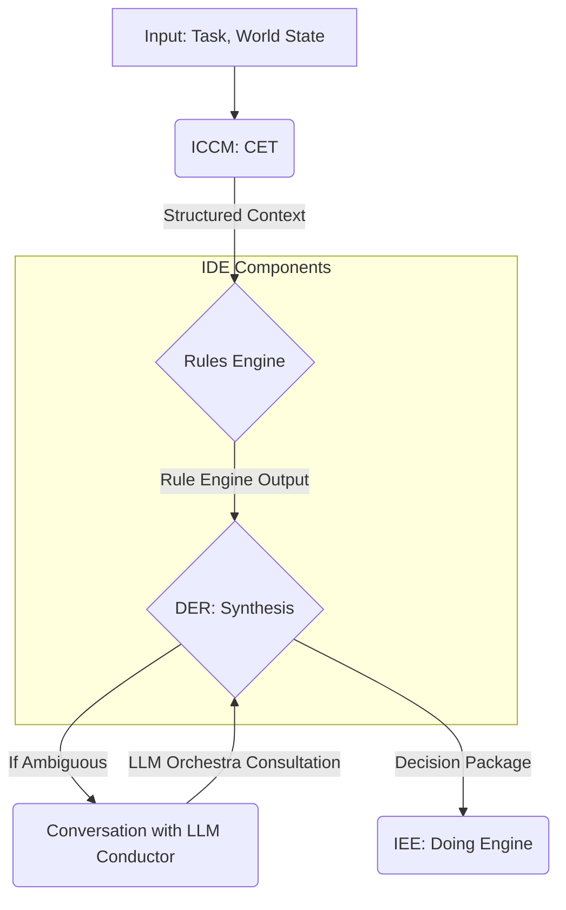

# Paper 00: Intelligent Decision Engineering (IDE) - Master Document

**Version:** 1.1
**Date:** 2025-10-07
**Status:** DRAFT - Council of Elders Synthesis v1.1
**Repository:** Joshua (IDE discipline within IAE ecosystem)
**Synthesized by:** Council of Elders (Gemini 2.5 Pro, GPT-5, Claude Opus 4)

---

## Changelog

- **v1.1 (2025-10-07):** Incorporated Council of Elders feedback.
    - Replaced "trinity (ICCM + IDE + MAD)" with the correct **quaternary structure (ICCM + IDE + IEE + IAE)**. IAE is the assembly discipline.
    - Corrected Thinking Engine composition; LLM Orchestra is an external capability, not a core component.
    - Replaced implementation-specific name "Fiedler" with the proper MAD type **LLM Conductor**.
    - Aligned data object names with the **Canonical Contracts** defined in IAE Paper 00 (e.g., `Structured Context`, `Rule Engine Output`, `Decision Package`).
- **v1.0 (2025-10-06):** Initial master document.

---

## Executive Summary

The **Intelligent Decision Engineering (IDE)** discipline provides the formal framework for decision-making within the IAE ecosystem. IDE produces two critical components of the MAD Thinking Engine: the **Rules Engine** and the **DER (Decision Engineering Recommender)**.

IDE bridges traditional symbolic AI and modern probabilistic reasoning, creating a hybrid architecture that delivers transparency, auditability, and adaptability. By integrating with CET (from ICCM) for structured context and consulting the **LLM Orchestra** capability (via an **LLM Conductor** MAD) for novel scenarios, IDE enables agents to make decisions that are both explainable and effective.

**The Quaternary Structure:**
- **ICCM (Context Engineering):** Produces CET → Component #1 of MAD Thinking Engine.
- **IDE (Decision Engineering):** Produces Rules Engine + DER → Components #2 & #3 of MAD Thinking Engine.
- **IEE (Execution Engineering):** Produces the Doing Engine for action execution.
- **IAE (Agent Assembly):** Integrates all components, provides the State Manager, and defines the overall architecture.

---

## 1. Introduction: The Decision Problem in AI Agents

### 1.1 Why Decision Engineering Matters

Modern AI agents often function as "black boxes," making it difficult to trace, audit, or predict their behavior. IDE treats the decision-making faculty as an engineered system composed of distinct, verifiable components, ensuring that every decision is traceable, explainable, and, where possible, deterministic.

### 1.2 The IDE Discipline

**Input:** IDE components consume `Structured Context` from CET and state information from the State Manager.
**Process:** A hybrid, two-stage process:
1. A **Rules Engine** evaluates context against deterministic rules.
2. A **DER** synthesizes the rule output with broader context and, if necessary, consults probabilistic models via conversations.
**Output:** An actionable `Decision Package` with a confidence score and a complete reasoning trace.

### 1.3 The Quaternary of Disciplines

IDE is an indispensable link in a **quaternary** of disciplines that enable robust MAD systems.

| Discipline | Repository | Primary Output | Role in MAD Ecosystem |
|------------|------------|----------------|----------------------|
| **ICCM** | ICCM | **CET** | **Context Engineering:** Answers "What is the situation?" |
| **IDE** | Joshua | **Rules Engine + DER** | **Decision Engineering:** Answers "What should be done?" |
| **IEE** | Joshua | **Doing Engine** | **Execution Engineering:** Answers "How is it done?" |
| **IAE** | Joshua | **Complete Agents** | **Agent Assembly:** Integrates everything. |

This separation of concerns is fundamental. ICCM masters *understanding*, IDE masters *choosing*, IEE masters *acting*, and IAE masters *assembling*.

**In the MAD Thinking Engine:**
The Thinking engine has four components: CET (from ICCM), Rules Engine (from IDE), DER (from IDE), and State Manager (from IAE).

---

## 2. Theoretical Foundation

*(This section remains largely the same, focusing on principles of transparency, auditability, etc.)*

### 2.3 Decision Flow in the MAD Thinking Engine

The flow of information through the IDE components is precise and ordered.

**Process Steps:**

1.  **Context Engineering (ICCM):** CET produces a `Structured Context` object.
2.  **Deterministic Check (IDE):** The context is passed to the Rules Engine, which produces a `Rule Engine Output` object.
3.  **Synthesis (IDE):** The DER receives the `Structured Context` and `Rule Engine Output`.
4.  **Probabilistic Consultation (Optional):** If the rule output is insufficient, the DER initiates a *conversation* with an **LLM Conductor** MAD to access its LLM Orchestra capability.
5.  **Decision (IDE):** The DER synthesizes all inputs into a final `Decision Package`, including a confidence score and reasoning trace.
6.  **Action (IEE):** The `Decision Package` is passed to the agent's Doing Engine for execution.

---

## 3. Architecture Components

### 3.1 Rules Engine Specification

**Input:** `StructuredContext` from CET.
**Output:** A `RuleEngineOutput` object, as defined in the IAE Canonical Contracts.

*(Implementation details remain the same)*

### 3.2 DER (Decision Engineering Recommender) Specification

**Input:** `StructuredContext`, `RuleEngineOutput`, and optional `LLMOrchestraConsultation` from an LLM Conductor.
**Output:** A `Decision Package`, as defined in the IAE Canonical Contracts.

*(Processing logic remains the same)*

### 3.3 Integration with CET (ICCM)

The interface is the formal `Structured Context` schema defined in IAE Paper 00.

### 3.4 Integration with LLM Orchestra (via LLM Conductor)

The DER's interaction with an LLM Conductor MAD is a formal **conversation**, not a function call. It uses the MAD-to-MAD messaging protocols defined in IAE Paper 00. The DER sends a `ConsultationRequest` and receives a `ConsultationResponse`. The LLM Orchestra serves as a panel of probabilistic experts; the DER retains ultimate authority.

---

## 7. Relationship to ICCM, IEE, and IAE

### 7.1 ICCM → IDE Boundary

The interface is the `Structured Context` schema.

### 7.2 IDE → IEE Boundary

The interface is the `Decision Package` schema. IDE produces the decision; IEE executes it.

### 7.3 Role within IAE

IDE provides the core reasoning components (Rules Engine, DER). The IAE discipline assembles these with CET, the State Manager, and a Doing Engine to create a complete agent following the MAD pattern.

### 7.4 The Complete MAD Thinking Engine

The Thinking Engine is a composite architecture from multiple disciplines.
`MAD Thinking Engine = CET (ICCM) + Rules Engine (IDE) + DER (IDE) + State Manager (IAE)`

*(Remaining sections on paper structure, roadmap, etc., are omitted for brevity but would be updated to reflect these foundational changes.)*

---

### **IEE Paper 00 v1.1 (Synthesized by Claude Opus 4)**

--- 00_IEE_Intelligent_Execution_Engineering_v1.1.md ---
