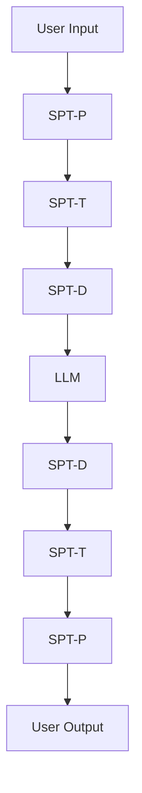

# ICCM Publication Strategy: Modular, Iterative, Open Source
## A Framework for Living Research Documents

---

## The Problem with Monolithic Papers

The ICCM framework is too comprehensive for a single paper. Current challenges:
- **Context Window Limits**: Even advanced models struggle with 50k+ token papers
- **Review Complexity**: Reviewers cannot provide detailed feedback on massive documents
- **Update Friction**: Small changes require re-reviewing entire documents
- **Accessibility**: Dense academic papers don't serve broader audiences
- **Collaboration Barriers**: Single documents don't enable distributed contribution

---

## Proposed Modular Architecture

### Core Structure: Hub + Spokes Model

```
ICCM Research Hub
├── 📄 Core Conceptual Paper (8-12 pages)
├── 📚 Deep Dive Papers (15-25 pages each)
│   ├── 🧠 Cognitive Foundations & Theory
│   ├── 🏗️  SPT Architecture & Training
│   ├── 🔒 Privacy & Federated Learning
│   ├── ⚡ Performance & Optimization
│   ├── 📊 Evaluation & Benchmarks
│   ├── 🛠️  Implementation Guide
│   └── 🔬 Experimental Results
├── 💬 Conversation Transcripts
├── 📽️  Video & Podcast Content
├── 💻 Open Source Code
└── 🔄 Living Reviews & Updates
```

---

## Document Types & Formats

### 1. **Core Conceptual Paper** (High-Level Overview)
**Format**: Traditional academic paper (LaTeX/PDF)
**Length**: 8-12 pages
**Audience**: Researchers, industry leaders, funding bodies
**Content**:
- Problem statement and motivation
- High-level ICCM framework
- SPT hierarchy overview
- Key innovations and contributions
- Future research directions
- References to deep-dive papers

**Status**: Extract and refine from current v3 paper

### 2. **Deep Dive Working Papers** (Living Documents)
**Format**: Enhanced Markdown with:
- Inline comments for collaboration
- Version tracking with git
- Issue tracking for TODOs
- Cross-references between papers
- Embedded code examples
- Interactive diagrams (Mermaid/PlantUML)

**Example Structure**:
```markdown
# SPT Architecture & Training Deep Dive

## Status: DRAFT v2.1
<!-- TODO: Address latency concerns from Gemini review -->
<!-- FIXME: Need concrete loss function definition -->

## Abstract
...

## 1. Introduction
<!-- COMMENT: This section needs expansion based on Claude's feedback -->
...

## 2. Training Methodology
<!-- ISSUE #47: Define synthetic data generation process -->
```

### 3. **Conversation Transcripts** (Research Process Documentation)
**Format**: Structured Markdown with metadata
**Purpose**:
- Show reasoning process
- Enable replication
- Provide context for decisions
- Create educational content

---

## Platform Evaluation

### Option 1: **Google Sites + Google Drive**
**Pros**:
- Easy collaboration and commenting
- Good for non-technical stakeholders
- Integrated with Google ecosystem
- Version history

**Cons**:
- Limited markdown support
- No code integration
- Not developer-friendly
- Limited customization

### Option 2: **GitHub + GitHub Pages**
**Pros**:
- Native markdown support
- Git version control
- Issue tracking
- Pull request workflow
- Free hosting
- Developer-friendly
- Automated CI/CD

**Cons**:
- Steep learning curve for non-developers
- Limited rich formatting
- No real-time collaboration

### Option 3: **Notion**
**Pros**:
- Rich formatting and databases
- Excellent collaboration features
- Comments and suggestions
- Good mobile support
- Template system

**Cons**:
- Proprietary platform
- Limited markdown export
- No git integration
- Can become cluttered

### Option 4: **GitBook**
**Pros**:
- Beautiful presentation
- Git integration
- Markdown-based
- Good collaboration features
- Public/private spaces

**Cons**:
- Paid for advanced features
- Less flexible than pure git
- Learning curve

### **RECOMMENDED: Hybrid Approach**

**Primary Platform**: GitHub + GitHub Pages
- Main repository for all content
- Issue tracking for TODOs and feedback
- Pull request workflow for contributions
- Automated publishing to GitHub Pages

**Secondary Platforms**:
- **Mirror to GitBook** for beautiful public presentation
- **Google Sites** for high-level overview and non-technical audiences
- **arXiv** for formal academic paper submissions
- **YouTube/Podcast platforms** for multimedia content

---

## Proposed Repository Structure

```
iccm-research/
├── papers/
│   ├── core/
│   │   ├── iccm-conceptual.md
│   │   └── iccm-conceptual.pdf (generated)
│   ├── deep-dive/
│   │   ├── 01-cognitive-foundations.md
│   │   ├── 02-spt-architecture.md
│   │   ├── 03-privacy-federated.md
│   │   ├── 04-performance-optimization.md
│   │   ├── 05-evaluation-benchmarks.md
│   │   ├── 06-implementation-guide.md
│   │   └── 07-experimental-results.md
│   └── reviews/
│       ├── claude-opus-review.md
│       ├── gemini-review.md
│       └── aggregate-weaknesses.md
├── conversations/
│   ├── 2025-01-27-spt-hierarchy.md
│   ├── 2025-01-27-review-discussions.md
│   └── metadata.yaml
├── code/
│   ├── prototypes/
│   ├── benchmarks/
│   └── examples/
├── media/
│   ├── videos/
│   ├── podcasts/
│   └── diagrams/
├── docs/
│   ├── _config.yml (GitHub Pages)
│   ├── index.md
│   └── roadmap.md
└── .github/
    ├── workflows/ (CI/CD)
    └── ISSUE_TEMPLATE/
```

---

## Working Document Features

### Enhanced Markdown Capabilities

**1. Inline Comments for Collaboration**
```markdown
<!-- @reviewer: This section needs more technical detail -->
<!-- TODO: Add performance benchmarks -->
<!-- DECISION: Using bidirectional processing based on 2025-01-27 discussion -->
```

**2. Status Tracking**
```markdown
## Document Status
- **Version**: 2.1
- **Last Updated**: 2025-01-27
- **Review Status**: Under review by Gemini
- **Implementation Status**: Concept phase
- **Next Milestone**: Define training objectives
```

**3. Cross-References**
```markdown
See [SPT Architecture](02-spt-architecture.md#training-methodology) for implementation details.

Related conversation: [SPT Hierarchy Discussion](../conversations/2025-01-27-spt-hierarchy.md)
```

**4. Issue Integration**
```markdown
<!-- ISSUE #23: Define concrete loss functions -->
<!-- FIXES #45: Added latency optimization section -->
```

**5. Interactive Diagrams**


---

## Collaborative Workflow

### 1. **Contribution Process**
1. **Issues**: Create issues for problems, suggestions, improvements
2. **Discussions**: Use GitHub Discussions for broader conversations
3. **Pull Requests**: Submit changes via PR for review
4. **Reviews**: Required reviews before merging significant changes
5. **Releases**: Tagged versions for major milestones

### 2. **Comment System**
- `<!-- TODO: -->` for action items
- `<!-- FIXME: -->` for known problems
- `<!-- DECISION: -->` for documented choices
- `<!-- @username: -->` for directed questions
- `<!-- SOURCE: -->` for citations and references

### 3. **Review Integration**
- Link review comments to specific lines
- Track response to reviewer feedback
- Maintain review history and responses

---

## Publication Strategy

### Phase 1: Foundation (Immediate)
1. **Set up GitHub repository** with initial structure
2. **Extract core conceptual paper** from current v3
3. **Create first deep-dive paper** (SPT Architecture)
4. **Establish workflow** with basic automation

### Phase 2: Content Development (1-2 months)
1. **Complete deep-dive papers** based on aggregate review feedback
2. **Add conversation transcripts** with structured metadata
3. **Create multimedia content** (videos explaining key concepts)
4. **Develop initial prototypes** and proof-of-concepts

### Phase 3: Community Building (2-6 months)
1. **Submit core paper to arXiv** and conferences
2. **Create public presentations** and talks
3. **Engage research community** for feedback and contributions
4. **Iterate based on feedback** and new developments

### Phase 4: Implementation (6+ months)
1. **Build working prototypes** for each SPT variant
2. **Create benchmarks and datasets** for evaluation
3. **Publish experimental results** and performance data
4. **Open source reference implementations**

---

## Success Metrics

### Engagement Metrics
- GitHub stars and forks
- Issue and discussion activity
- Pull request contributions
- Citation count (for formal papers)

### Quality Metrics
- Reviewer feedback incorporation
- Implementation progress
- Benchmark performance
- Community adoption

### Impact Metrics
- Industry adoption
- Academic citations
- Derived research projects
- Open source ecosystem growth

---

## Recommended Next Steps

### Immediate Actions
1. **Create GitHub repository** with proposed structure
2. **Extract core conceptual paper** (8-12 pages) from current v3
3. **Set up basic GitHub Pages** site for public access
4. **Create first working document** addressing top weakness (training objectives)

### This Week
1. **Transfer existing content** to new structure
2. **Create issue templates** for different types of feedback
3. **Set up automation** for PDF generation from markdown
4. **Begin first deep-dive paper** on SPT architecture

### This Month
1. **Complete modular paper structure**
2. **Integrate conversation transcripts**
3. **Create multimedia content plan**
4. **Engage initial collaborators and reviewers**

---

## Conclusion

The modular, iterative approach addresses all major concerns:
- **Manageable scope** for each document
- **Living documents** that evolve with feedback
- **Open collaboration** with transparent process
- **Multiple audiences** served by different formats
- **Iterative improvement** based on community input

This strategy transforms ICCM from a static academic paper into a dynamic research platform that can grow and evolve with the field.

---

*Strategy document for transitioning ICCM research to modular, collaborative format*